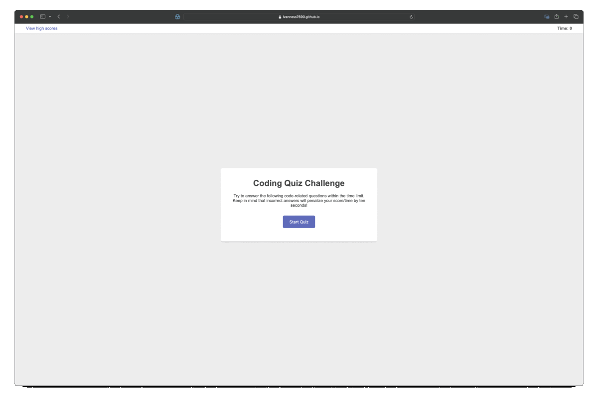

# Coding Quiz

## Description

To help with studying I built a timed coding quiz with multiple-choice questions. This app runs in the browser and features dynamically updated HTML and CSS powered by JavaScript. The page has a clean, polished, and responsive user interface. 

## Installation

N/A

## Usage

To being the quiz click on the Start Quiz button. Answer each question by selecting the correct answer. When you finish the quiz add your initials to view yourself on the leaderboard.

Here is a screenshot fo the website in action:

Here is a link of the website:

[https://lvanness7690.github.io/code-quiz/]

## Credits

N/A

## License

Please refer to the license in the repo.